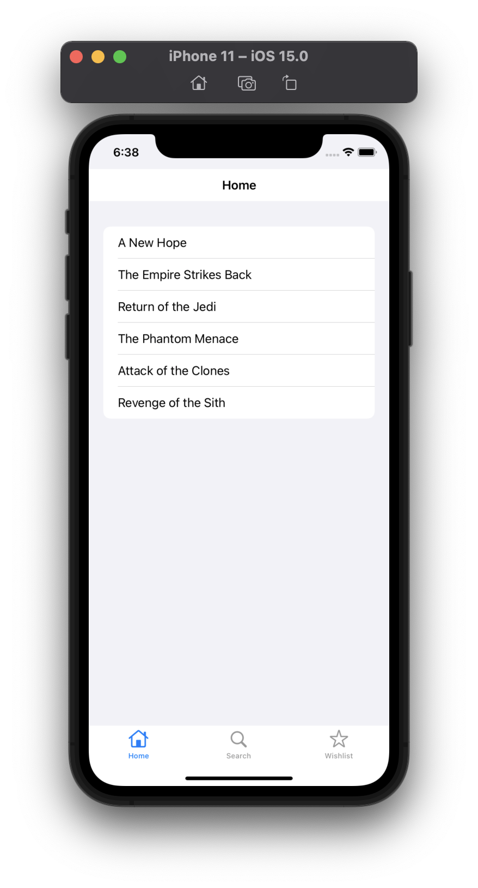
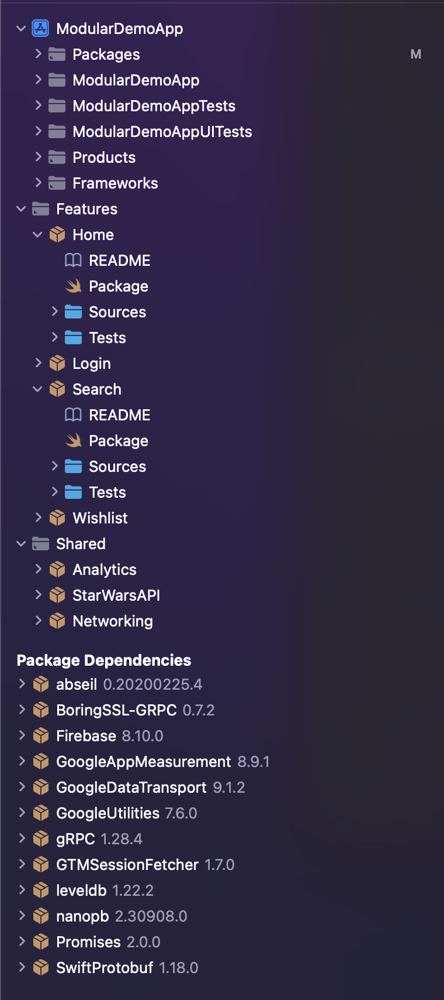

# Modular App Demo iOS 
Demo project for building an iOS app as a set of local modules managed via Swift Package Manager

## Environment
- macOS 12.2
- iOS 15.0
- Xcode 13.3.1

## Dependencies
See [Package.resolved](https://github.com/madhikarma/modular-app-demo-ios-swiftpm/blob/main/ModularDemoApp.xcworkspace/xcshareddata/swiftpm/Package.resolved) for full list

## Setup
- N/A

## Usage
- Open `ModularDemoApp.xcworkspace`
- From the Xcode menu Product > Run

## Screenshots

